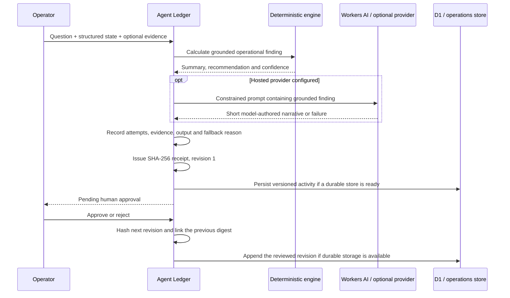

# AEGIS AI Agent Ledger

The **Agent Ledger** is a separate judge-facing site at `/agent-ledger`. It records what the AEGIS operations agent actually executed, which provider path it used, what evidence it received, what it proposed and whether a human approved or rejected it.

There are no seeded “success” events. A fresh store is empty, while the live D1 store now contains real release-acceptance executions, including an approved revision 2. Every displayed row must originate from an executed endpoint request.

## Why it exists

Emergency AI needs more than a chat window. A judge or operator should be able to answer:

- What question was asked?
- Which structured state sections and evidence were supplied?
- What did the deterministic engine calculate?
- Did a hosted model contribute text?
- Which provider/model attempts succeeded or failed, and how long did they take?
- Was a deterministic fallback used?
- Did a human approve or reject the recommendation?
- Can the record be checked for later modification?

The ledger makes those questions inspectable without exposing secrets or pretending an unexecuted action occurred.

## Execution sequence



The deterministic calculation always occurs before the optional language-model request. A hosted provider can add a concise narrative; it does not replace the numerical finding.

## Provider sequence and fallback

The server tries only providers that are actually available:

1. the zero-secret Cloudflare Workers AI `AI` binding with `@cf/meta/llama-3.2-3b-instruct`;
2. one generic OpenAI-compatible HTTPS endpoint, when configured;
3. Groq using one configured key, when configured;
4. AEGIS deterministic fallback if no hosted provider is available or every attempt fails.

Each hosted attempt has a bounded timeout. The log records provider, model, timestamps, latency, status and a sanitised failure description. Configured provider keys are not included in the activity record or readiness response.

The deterministic fallback is a supported execution mode, not a fake hosted-model success.

The Workers AI request contains only the bounded, redacted operator question, deterministic finding and sanitised evidence labels. Detectable credentials and email addresses are removed before any hosted-provider call. Output is capped at 220 tokens. Cloudflare currently includes [10,000 Neurons per day](https://developers.cloudflare.com/workers-ai/platform/pricing/) on the Workers Free plan; when that daily allowance or capacity is unavailable, the failed attempt is logged and AEGIS continues through its declared provider/fallback path. AEGIS never describes a failed Workers AI request as a successful hosted response.

## Logged record

Each activity contains:

- action name, channel and actor;
- correlation ID, request/completion timestamps and total latency;
- sanitised input summary, character count and supplied state-section names;
- deterministic summary, recommendation and confidence;
- model-authored narrative only when a hosted response was actually returned;
- execution mode, selected provider/model and fallback reason;
- every provider attempt, status, latency and token usage when the provider reports it;
- evidence citations and their verification state;
- human-approval requirement, status, reviewer, review time and note;
- SHA-256 receipt ID, digest, revision and previous digest after review.

Operator-supplied evidence remains labelled unverified until a separate verification process establishes otherwise. The internal deterministic method citation is labelled as a verified internal method, not as external observation.

## API

| Method | Route | Behaviour |
| --- | --- | --- |
| `GET` | `/api/agent-activity?limit=...` | List merged runtime/durable records plus storage and provider readiness |
| `POST` | `/api/agent-activity` | Execute a grounded brief, log provider path/evidence, issue a receipt and attempt durable persistence |
| `PATCH` | `/api/agent-activity` | Human approve/reject by receipt ID, increment revision and create the next hash-linked receipt |
| `POST` | `/api/operations` | Run the main Decision Brief and write through the same audit layer |

Requests are bounded and schema-validated. Public execution and review writes share a limit of 10 writes per client per minute, including the main `/api/operations` write path, so a hosted key is not an unmetered public proxy. This limiter is runtime-isolate local; it is not a globally distributed rate limiter, so production deployments that need broader abuse protection should also enforce an edge-level rate policy. The API returns an audit receipt header for executed/reviewed activity. Storage order is Cloudflare D1, the FastAPI versioned store, then a bounded runtime ledger. If neither durable service is available, storage is visibly labelled `runtime-only`.

## Optional server environment

No key is required because the deterministic fallback remains executable.

| Variable | Purpose |
| --- | --- |
| `OPENAI_COMPATIBLE_PROVIDER` | Human-readable provider name |
| `OPENAI_COMPATIBLE_BASE_URL` | OpenAI-compatible API base URL |
| `OPENAI_COMPATIBLE_API_KEY` | Server-side compatible-provider key |
| `OPENAI_COMPATIBLE_MODEL` | Provider model identifier |
| `GROQ_API_KEY` | Server-side Groq key |
| `GROQ_MODEL` | Groq model identifier; the current source defaults to `openai/gpt-oss-20b` |

Never prefix these secrets with `NEXT_PUBLIC_`, display them in readiness output, include them in a GitHub Actions log, or commit them to an environment file.

Cloudflare Workers AI uses the Wrangler `AI` binding and requires no API key. Its low-latency narrative model and binding call follow Cloudflare's [`@cf/meta/llama-3.2-3b-instruct` model documentation](https://developers.cloudflare.com/workers-ai/models/llama-3.2-3b-instruct/).

Do not paste credentials or private personal data into an operator question, structured state or evidence field. Log redaction is defence in depth, not permission to submit secrets to a hosted model.

The Groq default follows its [documented 16 August 2026 migration](https://console.groq.com/docs/deprecations) from the retired Llama 3.1 8B endpoint to `openai/gpt-oss-20b`, which is also listed in Groq's [free-plan limits](https://console.groq.com/docs/rate-limits). Re-check those pages when preparing a later release.

## Cloudflare D1 ledger

Cloudflare deployments use the optional `AEGIS_LEDGER_DB` binding first. Migration `migrations/0001_agent_activity_ledger.sql` stores one immutable row per receipt revision. The composite primary key prevents overwriting an earlier revision. Reads load the retained revision chain, recompute each SHA-256 digest and verify every `previousDigest` link before the UI labels the latest receipt `VERIFIED`.

After creating the free D1 database, add the returned database ID to `wrangler.jsonc`:

```jsonc
"d1_databases": [
  {
    "binding": "AEGIS_LEDGER_DB",
    "database_name": "aegis-agent-ledger",
    "database_id": "7002cac6-920f-4766-8847-94bf70418ca2",
    "migrations_dir": "migrations"
  }
]
```

The repository binding is named `AEGIS_LEDGER_DB`. Before the first public write, apply its migration from the repository root:

```bash
npx wrangler d1 migrations apply aegis-agent-ledger --remote
```

The adapter follows Cloudflare's documented [`cloudflare:workers` environment binding](https://developers.cloudflare.com/workers/runtime-apis/bindings/) and [D1 Worker API](https://developers.cloudflare.com/d1/worker-api/). When the binding is absent or unavailable, storage falls back to the configured FastAPI operations store and then to the bounded runtime ledger.

D1 is only the durable store for Agent Ledger receipt revisions. It is **not** the scenario database, PostGIS spatial store, Redis cache, WebSocket event store or full operational backend.

## Dedicated hostname without duplicate logic

The live dedicated surface is https://aegis-agent-ledger-codefusion-2k26.guptashivaani233.workers.dev/agent-ledger. It shares the same implementation and D1 receipt-revision ledger as the main command center instead of copying provider, audit or persistence logic into a second application.

## Live release acceptance

- Main Worker version: `e0b147fe-0219-4193-ad09-b402aa498170`.
- Ledger Worker version: `4a840328-2982-4761-940b-95cb127c583b`.
- D1 migration was applied in APAC; cross-deployment `GET`, `POST` and human-review `PATCH` completed successfully.
- Workers AI returned the grounded narrative in approximately `1.94 s` during acceptance.
- The approved revision 2 persisted in D1 and its retained SHA-256 digest/revision links verified.

These checks prove request execution and record integrity for that acceptance run. They do not prove that operator-supplied external evidence is true or that future provider latency will match the sample.

## Judge demonstration — 25 seconds

1. Open the dedicated Agent Ledger; identify the release-acceptance record as a prior real execution, not seeded decoration.
2. Ask a grounded question such as “Prioritize hospital access at the selected minute.”
3. Run the audited brief.
4. Show the deterministic-first execution step, provider/model or fallback, attempts, evidence and SHA-256 receipt.
5. Approve or reject it and show the receipt revision and previous digest.

Suggested line:

> This is not a decorative AI feed. Every row exists because the endpoint really executed. AEGIS shows the deterministic finding, every hosted-provider attempt, evidence, fallback and human decision, then creates the next hash-linked receipt when the operator reviews it.

## Safe claims

- “The ledger records executed requests; it does not seed fictional demonstration events.”
- “The hosted model, when available, writes a constrained narrative over the deterministic finding.”
- “The SHA-256 receipt supports record-integrity checking; it is not a digital signature, third-party timestamp or proof that an external claim is true.”
- “A verified digest detects record changes against the receipt. The previous-digest link can be checked across retained revisions; neither claim establishes that source data is true.”
- “Runtime-only storage survives within the running server process, not a process restart.”
- “Durable mode uses D1 first, then the versioned FastAPI operations store when configured and reachable.”
- “Human approval records a decision; it does not dispatch real resources.”

## Claims to avoid

- “The AI autonomously made or executed the evacuation decision.”
- “The hash proves the underlying disaster facts are true.”
- “A provider failed over” unless its failed and subsequent successful attempts are visible.
- “This is a separate trained AEGIS foundation model.”
- “The activity is durable” when the page shows `RUNTIME`.
