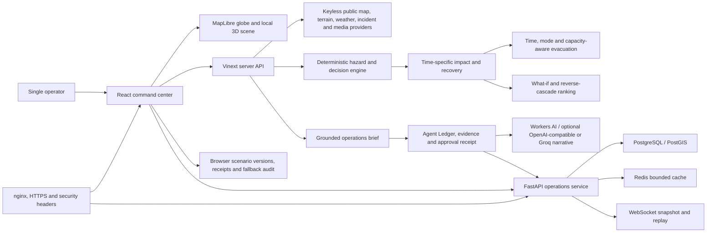
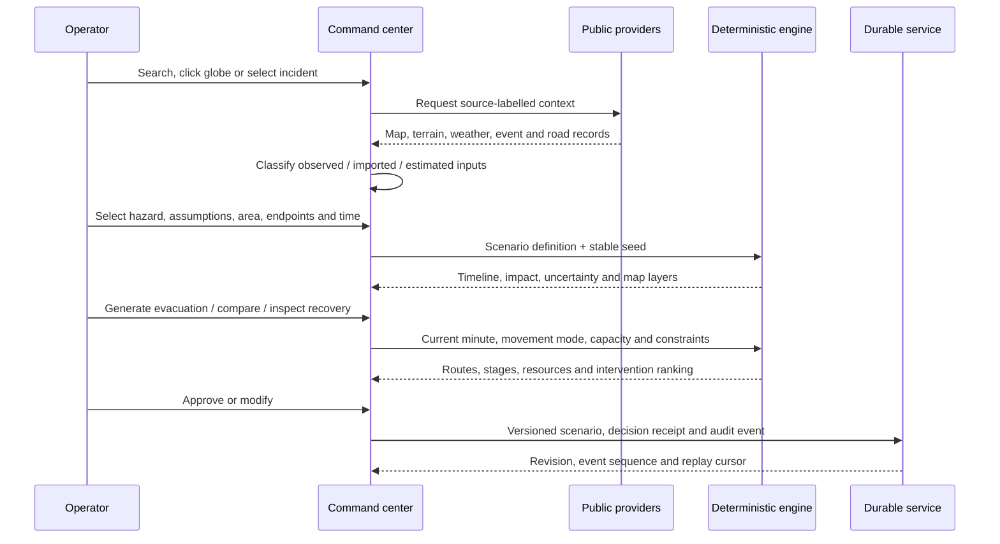
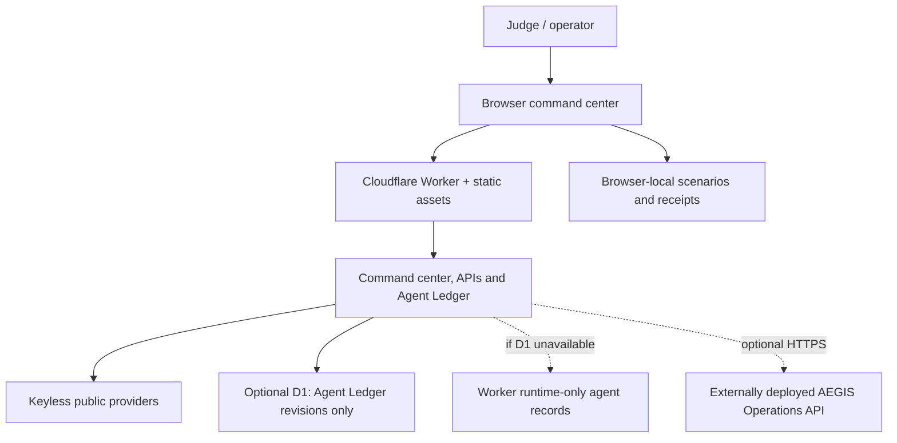
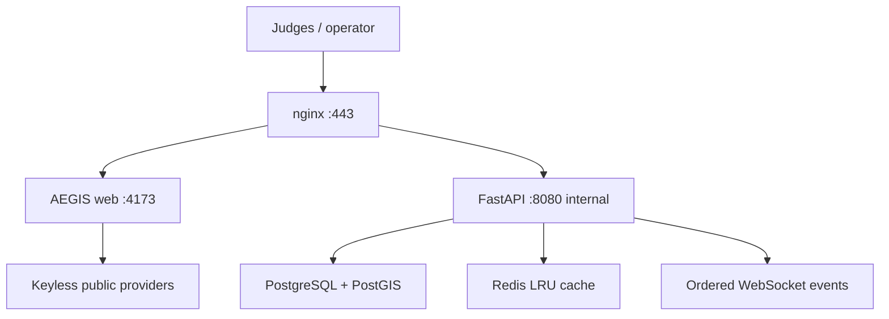

# AEGIS technical architecture

AEGIS is a single-operator emergency decision-support prototype with no login. The same React/vinext interface runs in the browser and Windows Tauri shell. The architecture preserves a hard boundary between external evidence, planning assumptions, deterministic consequences and human decisions.

## System context

## End-to-end data flow

## Architectural boundaries

### 1. Evidence adapters

Server routes retrieve and normalise public context. Every record carries its provider, timestamps and availability state. Cached source-backed data retains its original timestamp. Failure is reported as degraded/unavailable; it is never replaced with an invented observation.

### 2. Deterministic simulation core

Five hazard plugins share a versioned scenario contract, stable seed, 120-minute timeline, spatial asset model and consequence pipeline. Flood is the highest-fidelity prototype. Earthquake, wildfire, cyclone/surge and chemical release are executable screening models with hazard-specific fields and limitations.

### 3. Impact adapter

The selected timeline minute becomes building, road, bridge, facility, utility, population, secondary-consequence, uncertainty, recovery and re-entry layers. Rendering and metric panels consume the same snapshot, preventing the map and side panel from describing different times.

### 4. Evacuation and intervention layer

Candidate road geometry is screened at expected traversal time. Mode restrictions, throughput, destination capacity, resource availability, staged departure, remaining demand and isolated zones are explicit. What-if branches use the same seed. Reverse-cascade ranking compares downstream protection and feasibility; it does not approve an intervention.

### 5. Decision and AI layer

The current numerical operations brief is deterministic and returns summary, evidence, prediction, confidence, recommendation, risks and alternatives from structured state. Cloudflare Workers AI, a configured OpenAI-compatible endpoint or Groq may explain or reformat that grounded state, but must never become the source of depth, casualty, closure or capacity figures. Provider order is Workers AI first, then one configured OpenAI-compatible endpoint, then one configured Groq key, and finally the deterministic-only result. The separate `/agent-ledger` surface records actual executions, every provider attempt, latency, evidence, output, fallback, human disposition and a revisioned SHA-256 receipt. It does not seed fictional activity; the live D1 store retains genuine acceptance and operator executions.

### 6. Governance and persistence

Browser storage provides scenario versions, bookmarks, annotations, receipts and audit fallback. On Cloudflare, the optional `AEGIS_LEDGER_DB` D1 binding stores immutable Agent Ledger receipt-revision rows and verifies their SHA-256 digest links when reading them. D1 does not store scenarios or spatial assets. The FastAPI service adds durable versioned operational records, PostGIS spatial assets, optimistic conflict protection, ordered events, a SHA-256 linked audit receipt and reconnectable WebSocket replay.

## Operational pipeline

1. Retrieve source-labelled world incidents, weather-model context, basemap and optional local geometry.
2. Select any location, operating polygon, hazard source, origins and destinations.
3. Run a hazard plugin with explicit parameters, model version and stable seed.
4. Evaluate assets and planning populations at the selected minute.
5. Derive secondary consequences, uncertainty, confidence, recovery and re-entry screens.
6. Generate mode-aware staged evacuation alternatives constrained by hazard timing, route throughput and destination capacity.
7. Compare branches and rank screened interventions.
8. Require operator approval and preserve the decision receipt.
9. Save or replay records through the durable API; retain browser-local continuity if it is unavailable.

## Model fidelity

Flood produces depth, velocity, direction, arrival, peak, recession, external/internal building depth, affected floors, waterlines and access effects. It is a deterministic surface-water planning model, **not** a calibrated hydraulic solver.

The other four plugins are screening tools, not equal-fidelity physical twins:

- earthquake: shaking, structural/access and cascade screening;
- wildfire: spread, fuel/slope, flame/smoke and access screening;
- cyclone: track-relative wind, rainfall, surface water/surge and debris screening;
- chemical release: plume concentration, threshold exposure, shelter-in-place/PPE and access screening.

Casualty prediction and monetary damage remain disabled because validated vulnerability methods, asset values and damage curves have not been supplied. Exposure and assistance demand are not casualty counts.

## Rendering and performance

- The MapLibre globe is dynamically imported as a client chunk.
- OpenFreeMap is the primary vector provider and CARTO Dark Matter is the independent automatic fallback.
- Low-zoom Earth imagery, atmosphere, city lights, boundaries, labels and base 3D extrusion are layered separately from AEGIS operational data.
- Globe projection is used at world scale; local focus changes to a street/building-appropriate projection and camera.
- Rotation is bounded, pauses after interaction, stops in hidden tabs and respects reduced motion.
- Stable GeoJSON sources are updated only when their data references change.
- Campus animation uses bounded cadence and laptop-oriented LOD limits.
- Incident points cluster; public building, terrain, routing and live queries are bounded.
- Focused, Map-only and presentation layouts reduce panel/GPU load without changing the underlying state.
- A continuity renderer preserves basic world interaction if both external vector styles fail.

## Durable service controls

`backend/` provides strict Pydantic validation, payload limits, per-client rate limiting, request IDs, structured errors, restricted CORS, WebSocket origin and message checks, bounded replay and optimistic version-conflict handling. In production, PostgreSQL/PostGIS is the durable system of record and Redis holds disposable bounded cache entries.

## Deployment topologies

### Immediate public judge deployment

The Cloudflare target gives the command center and Agent Ledger a public HTTPS origin. If `AEGIS_LEDGER_DB` is bound and migrated, D1 durably stores only the Agent Ledger revision chain. Without D1, the ledger tries an externally reachable `AEGIS_OPERATIONS_API_URL`, then falls back to bounded Worker-runtime storage. Scenario history remains browser-local unless the full operations API is configured. Cloudflare does **not** deploy FastAPI, PostGIS, Redis or nginx.

### Oracle durable full stack

Docker Compose packages web, API, PostGIS, Redis and nginx with health checks, restart policies, no-new-privileges and log rotation. `deployment/` contains Oracle Ubuntu bootstrap, HTTP/HTTPS proxy configuration, firewall baseline, database migration, backup/restore, update, rollback and health scripts.

Creating the Oracle tenancy/instance, public IP, DNS record, TLS certificate and deployment secrets requires the owner’s accounts and authority. Those are external handoff steps, not missing source code.

## Active platform scope

Responsive web and Windows are active. Android/iPhone remain documentation-only. The Windows Tauri/WebView2 shell targets the same deployed application origin; it does not contain a separate numerical engine or database.
